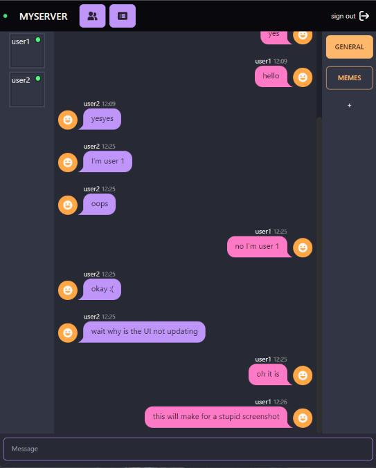

<div align="center">
  <h1>Svelte + gRPC Stream</h1>
  
  <p>:warning: work in progress :warning:</p>
  <p>Learning some Svelte by building a gRPC based chat system.</p>
</div>

## Infrastructure

This project consists of 5 infrastructure components
- Traefik: ingress controller and gRPC-Web proxy
- NATS: for queueing notifications that need to be relayed
- Redis: caches messages
- Relay (golang): Picks up messages from the queue and forwards them to a gRPC stream to the frontend
- Pocketbase: For user authentication
- Frontend (svelte & typecript): For sending notifications via the API and recieving notifications via the Relay.

## Documentation

- [docs](docs/readme.md)

## Requirements

- [node 20.3.0](nodejs.org) to run svelte app
- [golang 1.20](go.dev) to run the golang server
- [buf 1.21.0](buf.build) to generate code from protobuffers
- [docker 24.0.2](docker.com) to run services in docker compose

## Dev

- [relay](relay/readme.md)
- [api](api/readme.md)
- [frontend](frontend/readme.md)

## Ingress

In your hosts file set:

```plaintext
127.0.0.1 frontend.docker.localhost
```

After running `docker compose up`, <http://frontend.docker.localhost> should now be available via Traefik.

## Quickstart

```sh
docker compose up --build
```
