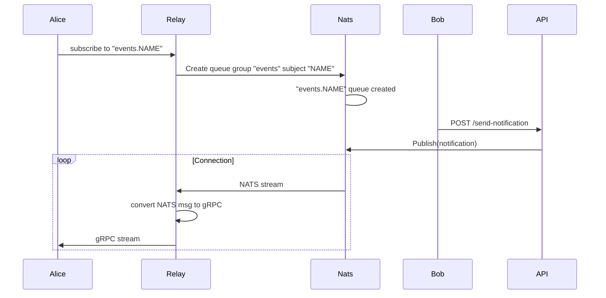

# Project

This document describes how this project works.

> Note: This is all subject to change

## Idea

The idea of this project is quite similar to the idea of a realtime chat application.

1. User A performs an action (sends a message).
2. User B receives a notification about the action (receives the message).

## Event flow

Whenever a user subscribes to realtime notifications, it creates a queue in NATS and the relay opens a stream back to the browser.



## Data

The message payload has the following structure

```yaml
subid: the NATS queue ID in the form of `group.subject`
text: the actual message
sender: where the message came from
```

The relay creates a hardcoded group called `events` and each user that presses the subscribe button is the `subject` on that group.
So for user `bob` the queue is named `events.bob`.

Anyone can subscribe to that queue but since it's a queue only one instance will pick up the latest message.
